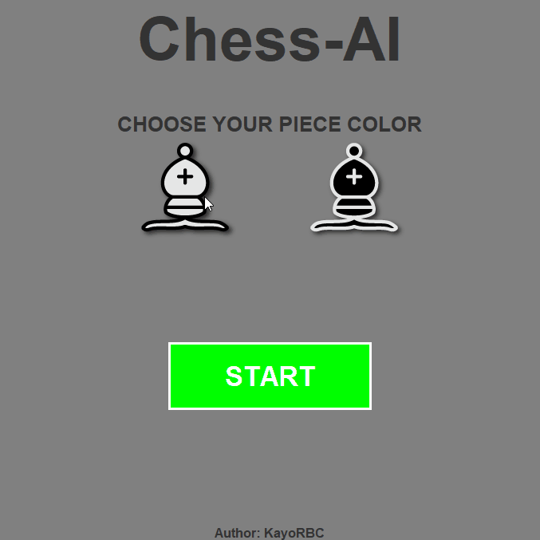
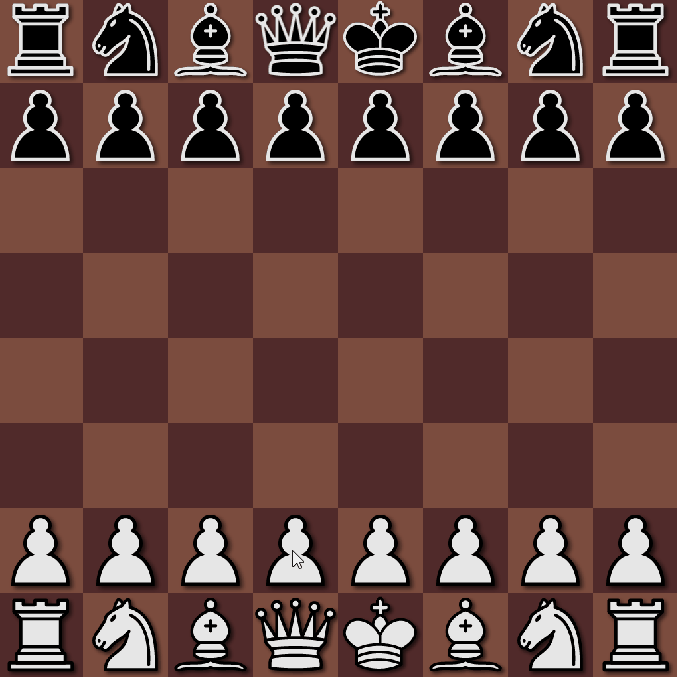
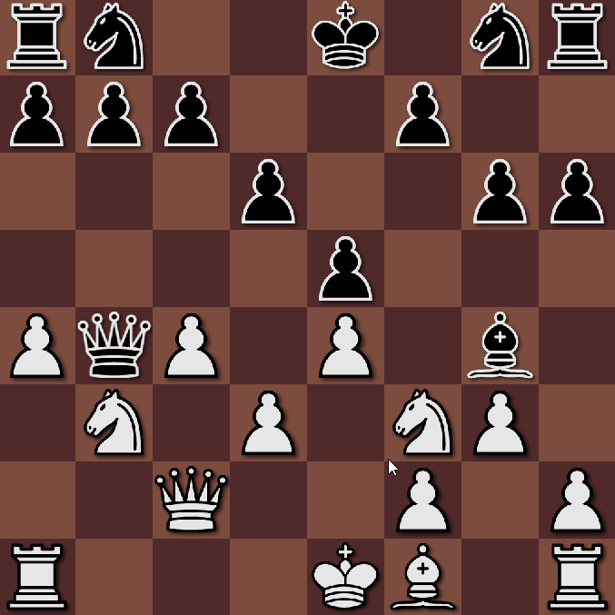

# ♟️Chess-AI♟️

###  🚧 Em desenvolvimento 🚧

## 📚Sobre o projeto
Neste projeto, o objetivo é criar um jogo em que o jogador joga xadrez contra uma IA. 

O que me levou a fazer esse projeto foi a disciplina de Inteligência Artificial do curso de **Ciência da Computação** da [PUCPR](https://www.pucpr.br). Um dos trabalhos era aplicar o algoritimo [**Alpha-Beta**](https://en.wikipedia.org/wiki/Alpha–beta_pruning) para predizer o melhor movimento esperado dado um estado do tabuleiro de xadrez. Após a apresentação do trabalho, decidi melhorar o código previamente desenvolvido e disponibilizá-lo.

## 🔮Planejamentos futuros
* Alterar a documentação e os comentários do código para inglês.
* Alterar o README para inglês.
* Adicionar uma imagem de fundo à tela inicial.
* Implementar o movimento [en passant](https://pt.wikipedia.org/wiki/En_passant).

## 🔧Tecnologias
* Java
* Maven
* Java Swing 

## 💡Como utilizar

### Tela inicial
Selecione a cor das suas peças de xadrez. A IA escolherá automaticamente a cor oposta escolhida. Em seguida clique no botão "START" para iniciar a partida.



### Tela do tabuleiro
O jogador pode selecionar duas posições do tabuleiro para realizar um movimento.



Caso algum peão do jogador chegue ao final do tabuleiro, 
serão exibidas opções para a promoção do peão.


Durante a partida, o histórico de jogadas será exibido no terminal.


Se alguém vencer, uma mensagem será exibida no centro do tabuleiro informando quem venceu, juntamente com um botão para retornar à tela inicial.



## 🚀Instalação, compilação e execução

### 🧩Pré-requisitos

* [Git](https://git-scm.com/downloads)
* [OpenJDK](https://openjdk.org) (16 ou superior) 
[Tutorial para Windows 10](https://www.youtube.com/watch?v=aaeWEB0Vmu4)

### 📦Instalação
1. Clone o projeto em uma cópia local usando o Git em um terminal com o Git instalado.
```bash
git clone https://github.com/KayoRBC/Chess-AI.git
```

### 🧱Compilação
IDE recomendada: [**IntelliJ**](https://www.jetbrains.com/pt-br/idea/).

1. Abra a cópia local do projeto no IntelliJ.

2. No canto superior direito do IntelliJ clique em Maven.

3. Expanda **Lifecycle** e clique duas vezes em **package**.

4. Na pasta target gerou o arquivo "Chess-IA-1.0.0.jar". Coloque em qualquer diretório de sua preferência.

### ▶️Execução

1. Abra o diretório que está o arquivo "Chess-IA-1.0.0.jar" no terminal e execute o seguinte comando:
```bash
java -jar .\Chess-IA-1.0.0.jar
```

2. Divirta-se jogando contra a IA 🗿.

## 📁Diretórios
* ```./src/main/resources/images``` Contém as imagens utilizadas.

* ```./src/main/java/com/chess_AI/controller/ImageController``` Responsável por carregar as imagens.

* ```./src/main/java/com/chess_AI/controller/AIController``` Responsável por utilizar o algoritmo Alpha-Beta.

* ```./src/main/java/com/chess_AI/controller/BoardController``` Responsável por realizar as jogadas no tabuleiro.

* ```./src/main/java/com/chess_AI/model``` Possui modelos da AI e de Board.

* ```./src/main/java/com/chess_AI/model/board/piece``` Possui as regras das peças.

* ```./src/main/java/com/chess_AI/view``` Front-end do jogo feito com a biblioteca Java Swing.

* ```./src/main/java/com/chess_AI/util``` Classes e funções que podem ser utilizadas em todas as camadas.

* ```./src/main/java/com/chess_AI/Main.java``` Arquivo principal onde inicia o código. 

## 🔗Links
* [Autor](https://github.com/KayoRBC)
* [Imagens do tabuleiro e das peças](https://opengameart.org/content/chess-pieces-and-board-squares)